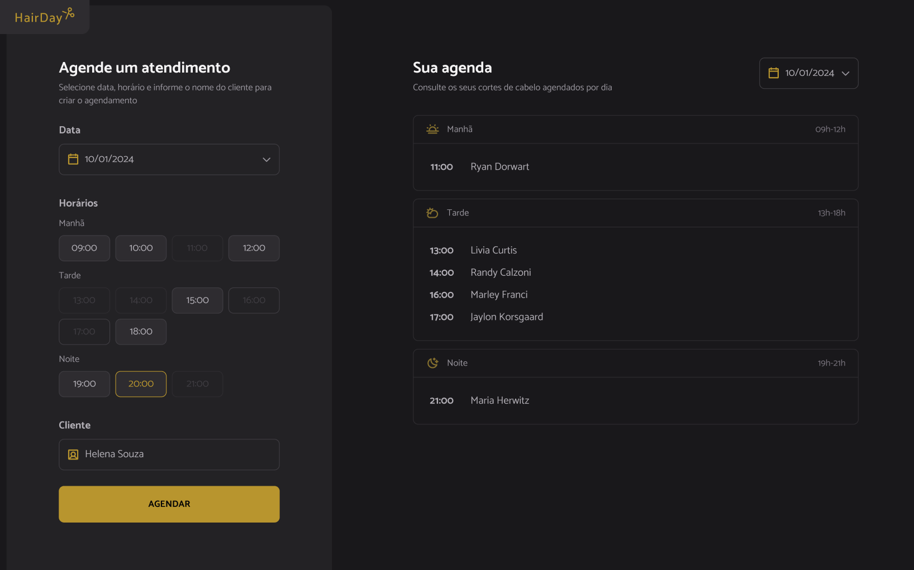

[PROJECT__BADGE]: https://img.shields.io/badge/📱Project_online_preview-000?style=for-the-badge&logo=project

<h1 align="center"> App de agendamento </h1>

  <a href="#-tecnologias">Tecnologias</a>&nbsp;&nbsp;&nbsp;|&nbsp;&nbsp;&nbsp;
  <a href="#-tecnologias">Funcionalidades</a>&nbsp;&nbsp;&nbsp;|&nbsp;&nbsp;&nbsp;
  <a href="#-projeto">Projeto</a>

 

  

## 💻 Projeto

Uma página para um gerenciador de agendamentos de corte de cabelo.  
Projeto desenvolvido para praticar manipulação de elementos e validação de inputs com JavaScript.

## ⚙️ Funcionalidades

- Formulário para escolher dentre os horários disponíveis
- Criar agendamento
- Cancelar agendamento
- Lista de agendamentos organizada por períodos do dia

## 🚀 Tecnologias

Esse projeto foi desenvolvido com as seguintes tecnologias:

- HTML
- CSS
- JavaScript
